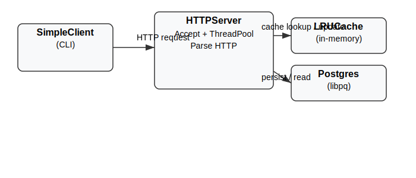

# kv-server — System Description

This document briefly describes the lightweight key/value server I worked on in this workspace. It pulls together the project structure, components, build/run notes, and a small architecture figure.

## Overview

kv-server is a simple demonstration key/value store implemented in C++17. It consists of:

- A tiny command-line HTTP client (`client/simple_client.cpp`) used for manual testing.
- An HTTP server (`src/server.cpp`) that implements a minimal key/value REST API (PUT/GET/DELETE on `/kv/<key>`).
- An in-memory LRU cache (`include/cache.h` + `src/cache.cpp`) to accelerate reads.
- A thread pool (`include/threadpool.h` + `src/threadpool.cpp`) to process connections concurrently.
- A persistent backend using PostgreSQL via libpq (`include/database.h` + `src/database.cpp`) for durability.

The codebase is intentionally minimal and educational rather than production-grade. Key design choices:

- Raw sockets and minimal HTTP parsing (request line + blank-line split) — this keeps the server small.
- The client and server use a simple read-until-EOF protocol; the client shuts down the write side after sending to avoid deadlocks.
- The database layer is a thin wrapper around libpq.

## Components

- SimpleClient (CLI)
  - Sends a raw HTTP request over TCP to the server.
  - Commands: `put <key> <value>`, `get <key>`, `delete <key>`.

- HTTPServer
  - Listens on a TCP port, accepts connections, and hands them to a ThreadPool.
  - Parses request line and body, performs cache/db operations, and responds with a status and body.

- LRUCache
  - In-memory cache using `std::list` + `std::unordered_map` for O(1) get/put and eviction.

- ThreadPool
  - Fixed-size pool of worker threads that execute tasks enqueued by the accept loop.

- Database (PostgreSQL)
  - Thin wrapper around libpq. Note: building the DB source requires `libpq-dev` (or equivalent) and linking with `-lpq`.

## File list (project snapshot)

The following files were present in the workspace when this document was generated:

{{FILE_LIST}}

## Build & run (local machine)

Install dependencies (Debian/Ubuntu):

```bash
sudo apt update
sudo apt install -y build-essential g++ cmake libpq-dev pandoc texlive-latex-recommended texlive-latex-extra texlive-fonts-recommended
```

Compile (simple ad-hoc commands used by this workspace):

```bash
# compile object files (example)
g++ -std=c++17 -Iinclude -pthread -c src/cache.cpp src/threadpool.cpp client/simple_client.cpp

# build client
g++ -std=c++17 client/simple_client.cpp -Iinclude -o build/simple_client -pthread

# build server (requires libpq)
g++ -std=c++17 -Iinclude -pthread src/*.cpp -o build/kv_server -lpq
```

Run server:

```bash
./build/kv_server 8080 4 100
```

Run client (examples):

```bash
./build/simple_client put key1 value1
./build/simple_client get key1
./build/simple_client delete key1
```

## Architecture diagram

Below is a small figure illustrating the main components (client -> server -> cache/db) and how requests flow.



## Notes on GitHub publishing

I don't currently have a public remote for this local workspace. To publish this repository to GitHub and get a public link, run the following steps locally (replace `<your-github-repo-url>` with the repo URL you create on GitHub):

```bash
# from the project root
git init
git add .
git commit -m "Initial commit of kv-server"
# On GitHub: create a new empty repository and copy its HTTPS URL, then:
git remote add origin <your-github-repo-url>
git branch -M main
git push -u origin main
```

After pushing, paste the repository URL here and I will include it in the PDF.

## About this PDF

This PDF was generated from the repository contents and a small hand-drawn SVG. If the automatic conversion on your machine fails, you can create the PDF locally with pandoc:

```bash
pandoc docs/system_description.md -o docs/kv_server_system_description.pdf
```

---

Generated on: {{DATE}}

---

If you'd like any changes to the text, a longer architecture diagram, or for me to include code snippets in the document, tell me which parts and I'll update the source and regenerate the PDF.
